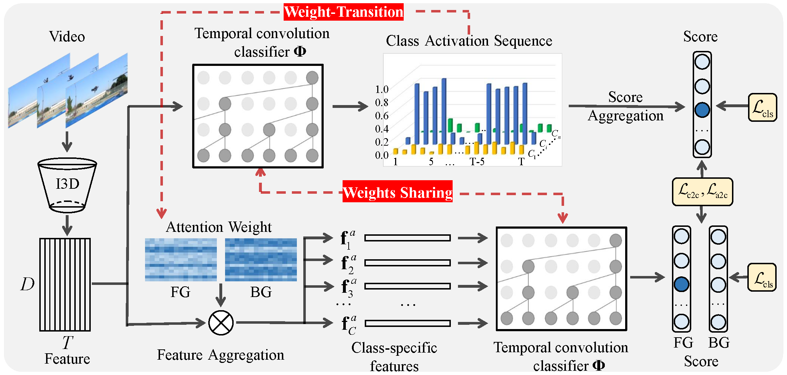

# Equivalent Classification Mapping for Weakly Supervised Temporal Action Localization

This repository is the official implementation of ECM. In this work, we study the weakly supervised temporal action localization and develop the Equivalent Classification Mapping (ECM) mechanism. Paper from [arXiv](https://arxiv.org/abs/2008.07728) or [IEEE](https://ieeexplore.ieee.org/abstract/document/9785717).




## Requirements

To install requirements:

```setup
conda env create -f environment.yaml
```

Before running the code, please activate this conda environment.

## Data Preparation

Download Thumos14 from [baiduyun](https://pan.baidu.com/s/1xlK854LWpl8K5CT_S4tc1g ) (code:ecmd).

Download ActivityNet1.2 from [baiduyun](https://pan.baidu.com/s/1xlK854LWpl8K5CT_S4tc1g ) (code:ecmd).

Download ActivityNet1.3  features from [baiduyun](https://pan.baidu.com/s/1xlK854LWpl8K5CT_S4tc1g ) (code:ecmd).	

	Please ensure the data structure is as below

~~~~
├── data
   └── Thumos14
       ├── val
           ├── video_validation_0000051.npz
           ├── video_validation_0000052.npz
           └── ...
       └── test
           ├── video_test_0000004.npz
           ├── video_test_0000006.npz
           └── ...
   └── ActivityNet1.2
       ├── training
           ├── v___dXUJsj3yo.npz
           ├── v___wPHayoMgw.npz
           └── ...
       └── validation
           ├── v__3I4nm2zF5Y.npz
           ├── v__8KsVaJLOYI.npz
           └── ...
   └── ActivityNet1.3
       ├── training
           ├── v___c8enCfzqw.npz
           ├── v___dXUJsj3yo.npz
           └── ...
       └── validation
           ├── v__1vYKA7mNLI.npz
           ├── v__3I4nm2zF5Y.npz
           └── ...
     
~~~~

## Training

To train the ECM model on THUMOS14 dataset, please first run this command:

```train
cd ./tools
python train.py -dataset THUMOS14
```
To train the ECM model on ActivityNet v1.2 dataset, please run this command:

```train
cd ./tools
python train.py -dataset ActivityNet1.2
```
To train the ECM model on ActivityNet v1.3 dataset, please run this command:

```train
cd ./tools
python train.py -dataset ActivityNet1.3
```


## Evaluation

To evaluate ECM model on Thumos14, run:

```eval
python eval.py -dataset THUMOS14 -weight_file ../checkpoints/THUMOS14_best.pth
```
To evaluate ECM model on ActivityNet1.2, run:

```eval
python eval.py -dataset ActivityNet1.2 -weight_file ../checkpoints/ActivityNet1.2_best.pth
```
To evaluate ECM model on ActivityNet1.3, run:

```eval
python eval.py -dataset ActivityNet1.3 -weight_file ../checkpoints/ActivityNet1.3_best.pth
```


## Pre-trained Models

You can download pre-trained models here:

- THUMOS14_best.pth [baiduyun](https://pan.baidu.com/s/1xlK854LWpl8K5CT_S4tc1g ) (code:ecmd) trained on THUMOS14 using parameters same as "./experiments/THUMOS14.yaml". 
- ActivityNet1.2_best.pth [baiduyun](https://pan.baidu.com/s/1xlK854LWpl8K5CT_S4tc1g ) (code:ecmd) trained on ActivityNet v1.2 using parameters same as "./experiments/ActivityNet1.2.yaml". 
- ActivityNet1.3_best.pth [baiduyun](https://pan.baidu.com/s/1xlK854LWpl8K5CT_S4tc1g ) (code:ecmd) trained on ActivityNet v1.2 using parameters same as "./experiments/ActivityNet1.3.yaml". 


## Results

Our model achieves the following performance on :

### [THUMOS14](https://www.crcv.ucf.edu/THUMOS14/home.html)

| threshold | 0.1   | 0.2   | 0.3   | 0.4   | 0.5   | 0.6   | 0.7   | 0.8  | 0.9  |
| --------- | ----- | ----- | ----- | ----- | ----- | ----- | ----- | ---- | ---- |
| mAP       | 62.61 | 55.05 | 46.47 | 38.19 | 29.13 | 19.50 | 10.88 | 3.80 | 0.42 |

### [ActivityNet v1.2](http://activity-net.org/)

| threshold | average-mAP | 0.50  | 0.55 | 0.60  | 0.65  | 0.70  | 0.75  | 0.80  | 0.85  | 0.90  | 0.95 |
| --------- | ----------- | ----- | ---- | ----- | ----- | ----- | ----- | ----- | ----- | ----- | ---- |
| mAP       | 25.45       | 40.96 | 37.7 | 34.24 | 31.46 | 28.49 | 24.94 | 21.16 | 16.95 | 12.13 | 6.46 |

### [ActivityNet v1.3](http://activity-net.org/)

| threshold | average-mAP | 0.50  | 0.55  | 0.60  | 0.65  | 0.70  | 0.75  | 0.80  | 0.85  | 0.90  | 0.95 |
| --------- | ----------- | ----- | ----- | ----- | ----- | ----- | ----- | ----- | ----- | ----- | ---- |
| mAP       | 23.48       | 36.68 | 34.08 | 31.52 | 29.01 | 26.49 | 23.56 | 20.04 | 16.08 | 11.42 | 5.92 |

## Citation
@article{zhao2022equivalent,
  title={Equivalent classification mapping for weakly supervised temporal action localization},
  author={Zhao, Tao and Han, Junwei and Yang, Le and Zhang, Dingwen},
  journal={IEEE Transactions on Pattern Analysis and Machine Intelligence},
  year={2022},
  publisher={IEEE}
}
