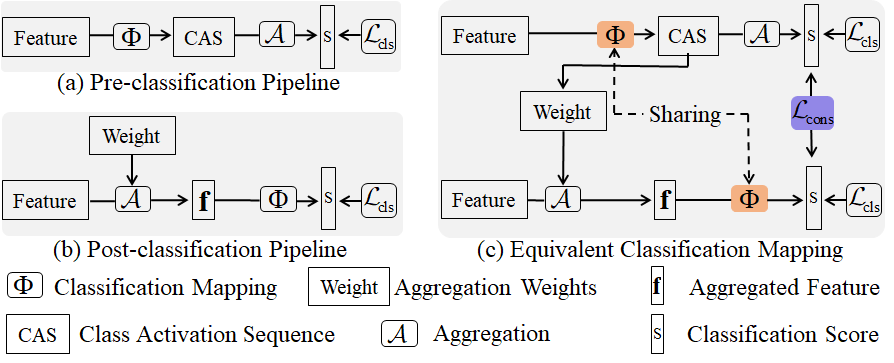

# Equivalent Classification Mapping for Weakly Supervised Temporal Action Localization

This repository is the official implementation of [Equivalent Classification Mapping for Weakly Supervised Temporal Action Localization](https://arxiv.org/abs/2030.12345). 
In this work, we study the weakly supervised temporal action localization task. The existing methods can be categorized into two localization-by-classification pipelines, i.e., the pre-classification pipeline and the post-classification pipeline. The pre-classification pipeline (see (a) in figure) first performs classification on each video snippet and then aggregate the snippet-level classification scores to obtain the video-level classification score, while the post-classification pipeline (see (b) in figure) aggregates the snippet-level features first and then predicts the video-level classification score based on the aggregated feature. Although the classifiers in these two pipelines are used in different ways, the role they play is exactly the same---to classify the given features to identify the corresponding action categories. That is, an ideal classifier can make both pipelines work. This inspires us to simultaneously learn these two pipelines in a unified framework to obtain an effective classifier. Specifically, in the proposed learning framework (see (c) in figure), we implement two parallel model streams to model two localization-by-classification pipelines, respectively, and make the two network streams share with the same classifier, thus achieving the novel Equivalent Classification Mapping (ECM) mechanism. Considering that an ideal classifier would make the classification results of the two network streams be identical and make the frame-level classification scores obtained from the pre-classification pipeline and the feature aggregation weights in the post-classification pipeline be consistent, we further introduce an equivalent classification loss and an equivalent weight transition module to endow the proposed learning framework with such properties. Comprehensive experiments are carried on three benchmarks which demonstrate our proposed ECM achieves superior performance over the other state-of-the-art methods..




## Requirements

To install requirements:

```setup
conda env create -f environment.yaml
```

Before running the code, please activate this conda environment.

## Data Preparation

Download Thumos14 from [Google Drive](https://drive.google.com/drive/folders/1GJi4yZROTNURo1j-TJlUfs0MBsITJ0Ug?usp=sharing).

Download ActivityNet1.2 from [Google Drive](https://drive.google.com/drive/folders/17wkaYBSbBD-80OhckLHJlUnvMDwgXyt4?usp=sharing).

Download ActivityNet1.3  features from [Google Drive](https://drive.google.com/drive/folders/1klht1i1HfNoxiss2UWBqdIznkeQAbxvc).	

	Please ensure the data structure is as below

~~~~
├── data
   └── Thumos14
       ├── val
           ├── video_validation_0000051.npz
           ├── video_validation_0000052.npz
           └── ...
       └── test
           ├── video_test_0000004.npz
           ├── video_test_0000006.npz
           └── ...
   └── ActivityNet1.2
       ├── training
           ├── v___dXUJsj3yo.npz
           ├── v___wPHayoMgw.npz
           └── ...
       └── validation
           ├── v__3I4nm2zF5Y.npz
           ├── v__8KsVaJLOYI.npz
           └── ...
   └── ActivityNet1.3
       ├── training
           ├── v___c8enCfzqw.npz
           ├── v___dXUJsj3yo.npz
           └── ...
       └── validation
           ├── v__1vYKA7mNLI.npz
           ├── v__3I4nm2zF5Y.npz
           └── ...
     
~~~~

## Training

To train the ECM model on THUMOS14 dataset, please first run this command:

```train
cd ./tools
python train.py -dataset THUMOS14
```
To train the ECM model on ActivityNet v1.2 dataset, please run this command:

```train
cd ./tools
python train.py -dataset ActivityNet1.2
```
To train the ECM model on ActivityNet v1.3 dataset, please run this command:

```train
cd ./tools
python train.py -dataset ActivityNet1.3
```


## Evaluation

To evaluate ECM model on Thumos14, run:

```eval
python eval.py -dataset THUMOS14 -weight_file ../checkpoints/THUMOS14_best.pth
```
To evaluate ECM model on ActivityNet1.2, run:

```eval
python eval.py -dataset ActivityNet1.2 -weight_file ../checkpoints/ActivityNet1.2_best.pth
```
To evaluate ECM model on ActivityNet1.3, run:

```eval
python eval.py -dataset ActivityNet1.3 -weight_file ../checkpoints/ActivityNet1.3_best.pth
```


## Pre-trained Models

You can download pretrained models here:

- [THUMOS14_best.pth](https://drive.google.com/file/d/1JHXl0M62X1y-SphEQQB2qttl3_3TQG2f/view?usp=sharing) trained on THUMOS14 using parameters same as "./experiments/THUMOS14.yaml". 
- [ActivityNet1.2_best.pth](https://drive.google.com/file/d/1kDMT-0zvDbsoocaqWso9lvYzJK1qWVRX/view?usp=sharing) trained on ActivityNet v1.2 using parameters same as "./experiments/ActivityNet1.2.yaml". 
- [ActivityNet1.3_best.pth](https://drive.google.com/file/d/1BleOkd5Zw5V_3pY0bE2v4i-nyiMhB9Xd/view?usp=sharing) trained on ActivityNet v1.2 using parameters same as "./experiments/ActivityNet1.3.yaml". 


## Results

Our model achieves the following performance on :

### [THUMOS14](https://www.crcv.ucf.edu/THUMOS14/home.html)

| threshold | 0.1   | 0.2   | 0.3   | 0.4   | 0.5   | 0.6   | 0.7   | 0.8  | 0.9  |
| --------- | ----- | ----- | ----- | ----- | ----- | ----- | ----- | ---- | ---- |
| mAP       | 62.61 | 55.05 | 46.47 | 38.19 | 29.13 | 19.50 | 10.88 | 3.80 | 0.42 |

### [ActivityNet v1.2](http://activity-net.org/)

| threshold | average-mAP | 0.50  | 0.55 | 0.60  | 0.65  | 0.70  | 0.75  | 0.80  | 0.85  | 0.90  | 0.95 |
| --------- | ----------- | ----- | ---- | ----- | ----- | ----- | ----- | ----- | ----- | ----- | ---- |
| mAP       | 25.45       | 40.96 | 37.7 | 34.24 | 31.46 | 28.49 | 24.94 | 21.16 | 16.95 | 12.13 | 6.46 |

### [ActivityNet v1.3](http://activity-net.org/)

| threshold | average-mAP | 0.50  | 0.55  | 0.60  | 0.65  | 0.70  | 0.75  | 0.80  | 0.85  | 0.90  | 0.95 |
| --------- | ----------- | ----- | ----- | ----- | ----- | ----- | ----- | ----- | ----- | ----- | ---- |
| mAP       | 23.48       | 36.68 | 34.08 | 31.52 | 29.01 | 26.49 | 23.56 | 20.04 | 16.08 | 11.42 | 5.92 |

